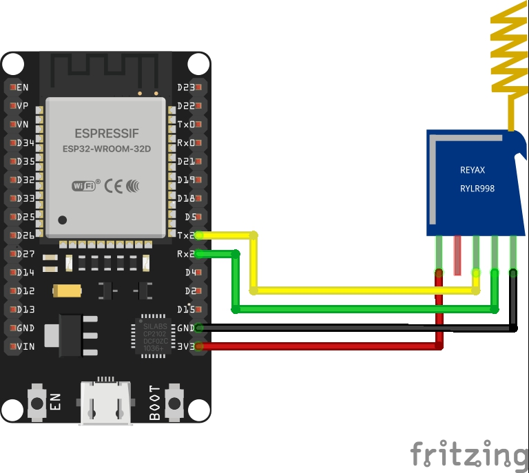
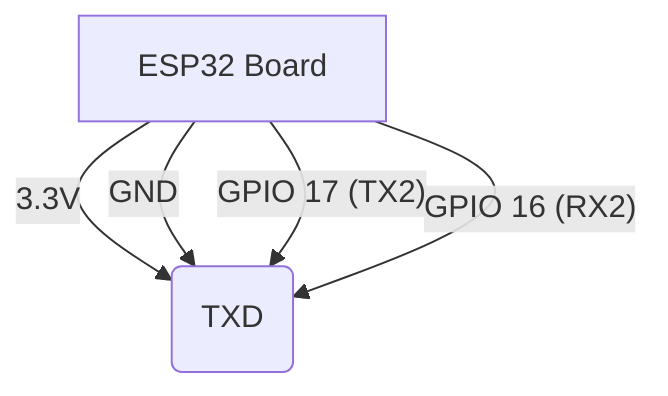

# Long Range LoRa P2P Communication with ESP32 & RYLR998

 

This repository contains the source code and documentation for setting up a **Point-to-Point (P2P) LoRa link** using the **Reyax RYLR998** module and an **ESP32**. 

This project was featured on my YouTube channel **IoT Bhai**. The code is designed to be simple, allowing you to switch between **Sender** and **Receiver** modes easily to test range and signal strength (RSSI).

## 📺 Watch the Tutorial
*[Link to your YouTube Video will go here]*

## 🛠 Hardware Required
* **2x** ESP32 Development Boards (DOIT DevKit V1 or similar)
* **2x** Reyax RYLR998 LoRa Modules
* **Jumper Wires** (Female-to-Female)
* **Power Source** (Power bank or LiPo battery for the mobile unit)

## 🔌 Circuit Diagram & Wiring
The RYLR998 communicates via UART. Since the module is 3.3V logic, it works directly with the ESP32 without logic level shifters.

| RYLR998 Pin | ESP32 Pin | Function |
|-------------|-----------|----------|
| **VDD** | 3.3V      | Power    |
| **GND** | GND       | Ground   |
| **TX** | GPIO 16   | RX2      |
| **RX** | GPIO 17   | TX2      |

> **Note:** Ensure your antennas are firmly connected before powering the modules to avoid damaging the RF chip.

### Wiring Schematic (Mermaid Backup)

💻 How to Use the Code
Open RYLR998_Dual_Mode.ino in Arduino IDE.

Install the ESP32 Board Support Package if you haven't already.

Configure Unit 1 (Sender):

Set localAddress = 1

Set destinationAddress = 2

Upload to the first ESP32.

Configure Unit 2 (Receiver):

Set localAddress = 2

Set destinationAddress = 1

Upload to the second ESP32.
